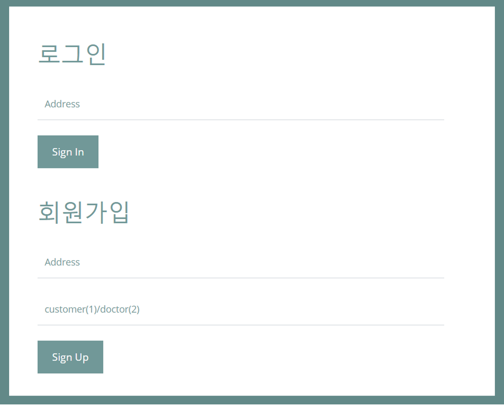
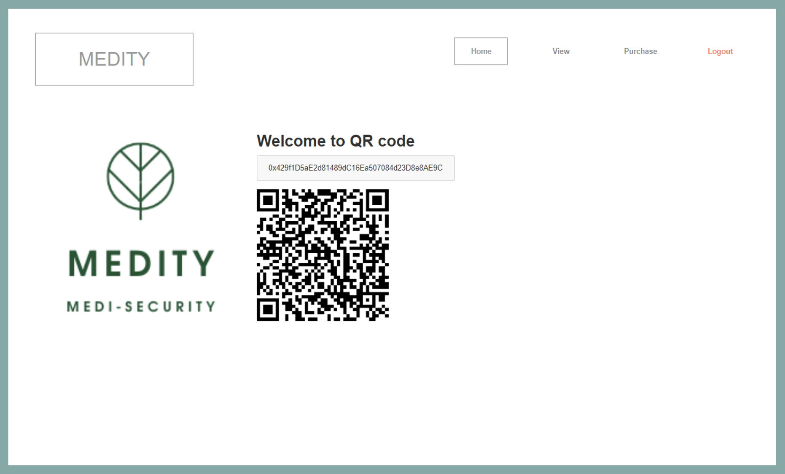
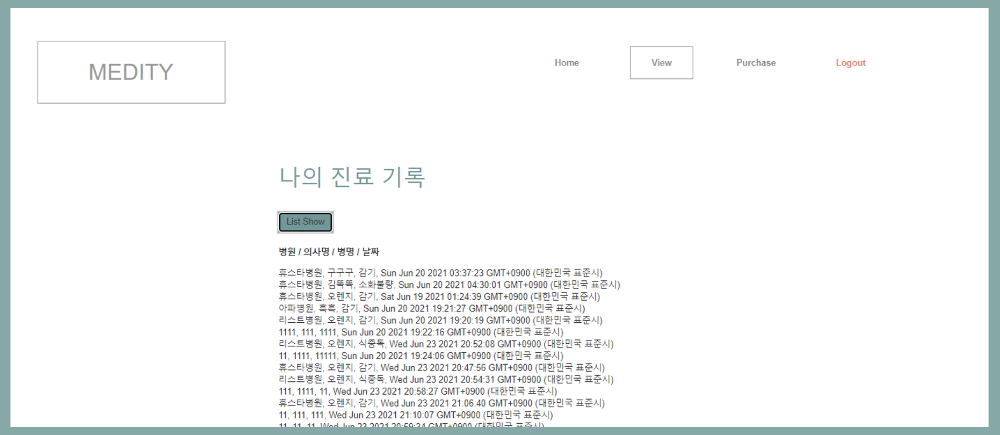
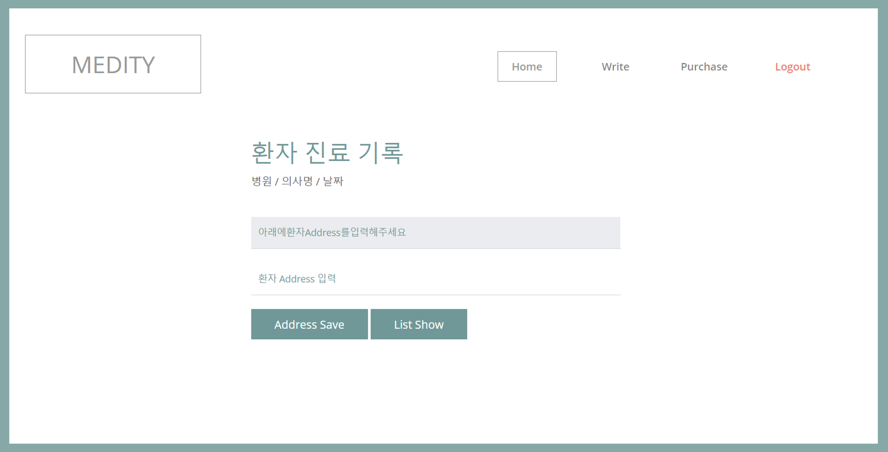
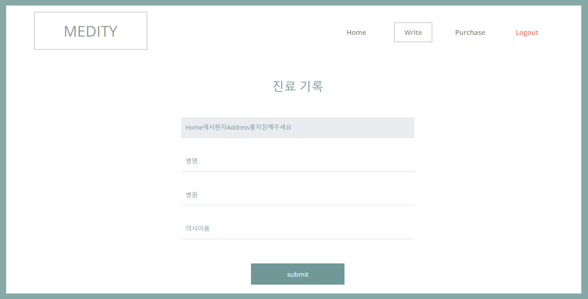
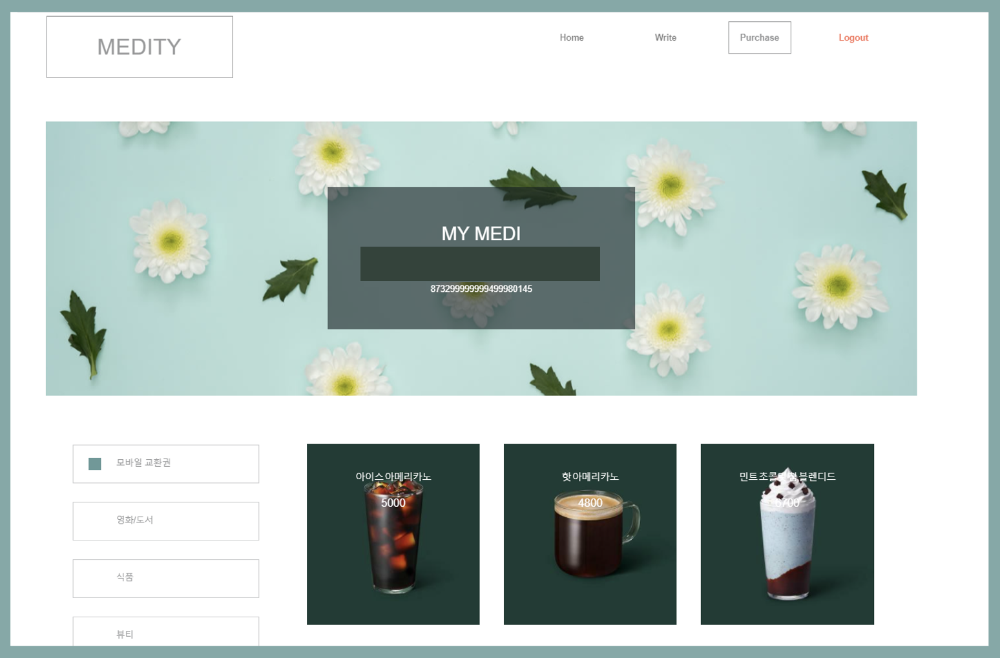

# Medity(Medi-Security)
## 프로젝트 선정 동기
> 병원에 갈 때마다 검사를 다시 받아야 되며, 이전에 어떤 진단을 받았는지 알기 어렵다. 따라서 개인이 의료 기록 데이터 배포를 관리할 수 있는 시스템을 블록체인을 활용하여 개발하고자 한다.
## 사용 기술
- HTML,CSS, javascript
- 블록체인
- Solidity
## 기능 설명
### 1. 공통 : 회원 가입 및 로그인

회원가입 시 회원은 1, 의사는 2를 입력한다. 입력한 값에 따라 로그인 시 다른 화면으로 이동한다.

### 2.1 회원 : QR 코드

### 2.2 회원 : 진료 기록 조회

### 3.1 의사 : 환자 진료 기록 조회

### 3.2 의사 : 환자 진료 기록 업로드

### 4. 공통 : 리워드 상점

## 특이 사항
실행시키는 서버에 따라 QR코드가 안나오기도 함  
많은 사람들이 사용하는 요인으로써 리워드 개념을 적용하려 하였으나, 아직 반영하지 못함. 따라서 리워드가 적립되지 않음

